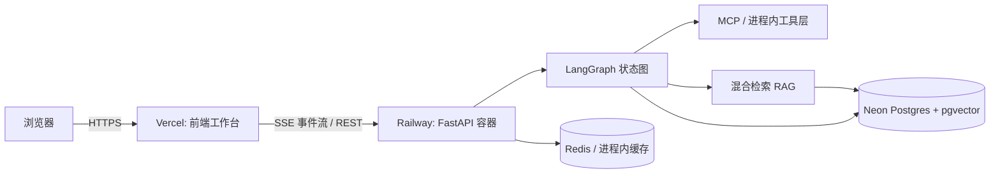
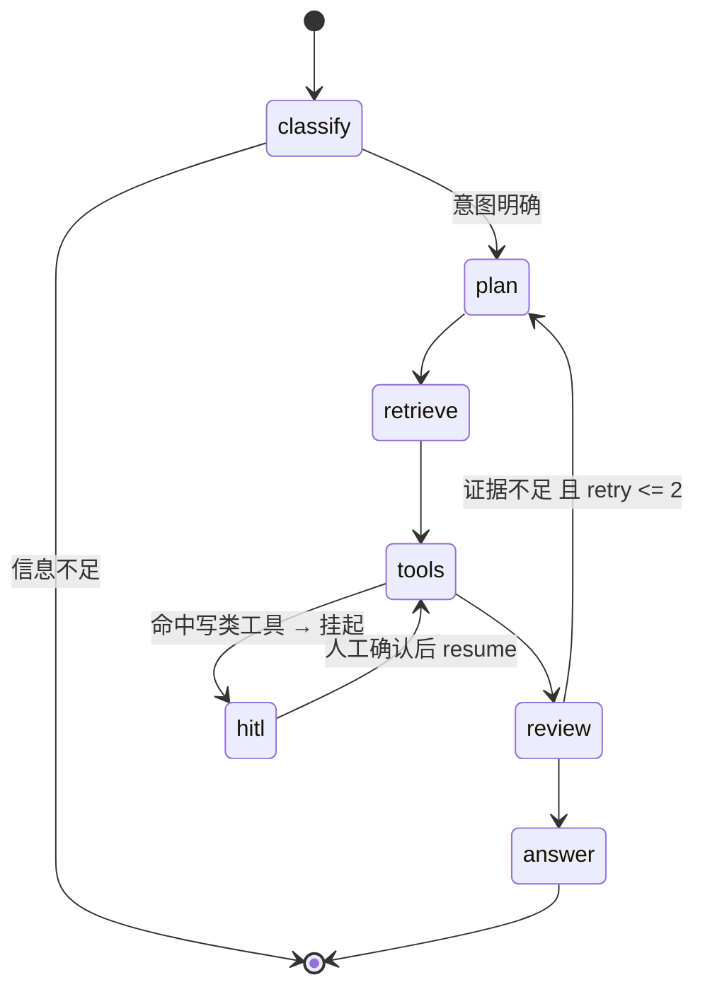

# AgentOps · 研发工单自动化 Agent 系统

面向研发工单场景的 **可控、可测、可观测** LLM Agent 系统：用户用自然语言提交问题，Agent 自主完成意图分类、任务规划、知识库检索与多工具调用，产出带引用的处理方案；涉及写操作时挂起等待人工确认，执行过程全链路可追踪、可回放、可评测。

- 后端：Python 3.12（`.python-version` 已固定 3.12，与容器镜像一致） + FastAPI + LangGraph + MCP
- 前端：**Next.js 15（App Router）** + React + TypeScript + Tailwind（执行链路可视化 / 审批 / 回放 / 评测看板）
- 部署：Vercel（前端） + Railway（后端容器） + Neon Postgres（pgvector）

## 架构



Agent 链路：



## 核心能力

| 能力 | 实现要点 |
| --- | --- |
| 用户账号 | 邮箱公开注册、验证与密码找回；Argon2id 密码、HttpOnly Cookie、可撤销会话；会话/运行/文档与检索按用户隔离 |
| 有状态编排 | LangGraph StateGraph 六节点；检查点持久化（Postgres，无库时内存兜底）；中断可恢复 |
| 工具层 | 5 个工具统一 Pydantic Schema；风险分级 read / write / high；超时重试、幂等键；3 个同时以 MCP Server 提供 |
| 人机协同（HITL） | 写类工具 `interrupt` 挂起，前端审批卡确认/改参后 `resume` 从检查点继续 |
| 工单总览 | 审批建单持久化到独立 Ticket 表，数据库幂等；`/tickets` 按用户分页，支持编辑业务状态与软删除 |
| 混合检索 RAG | pgvector 向量 + `tsvector` BM25 + RRF 融合 + 可选 Rerank；回答强制带引用锚点 |
| 引用溯源 | 工作台入库文档；引用使用片段 UUID，点击定位并预览原文；检索模式与原因随运行保存 |
| 可观测 | 事件总线 + SSE（含心跳与历史重放）；span 树落 `traces` 表；失败阶段（plan/retrieve/tools/generate）可定位 |
| 评测 | 120 条黄金集，分层断言 + 规则判定，输出成功率/工具准确率/延迟分位/成本，接入 CI 回归门禁 |
| 降级设计 | 无 LLM Key → 离线兜底；无 Embedding → 退化为 BM25；无 Redis → 进程内缓存；无数据库 → 仅健康检查与直接图评测可用，账号与工作台需要数据库 |

## 快速开始

> Python 版本固定为 **3.12**（`.python-version` = `3.12`），本地虚拟环境与容器镜像
> `python:3.12-slim` 保持一致。若本机没有 3.12，`scripts/bootstrap.sh` 会通过 winget 安装。

```bash
# 1. 环境与依赖（Windows / Git Bash）
bash scripts/bootstrap.sh

# 2. 配置 .env：DATABASE_URL、WEB_ORIGIN、RESEND_API_KEY、MAIL_FROM
# API_TOKEN 供前后端服务端共享；AGENT_MODE=graph 执行真实检索与审批建单
# echo 仅演示事件链路，不产生引用或工单；模型 Key 可选
cp .env.example .env

# 3. 建表并启用 pgvector
uv run python scripts/init_db.py

# 4. 启动后端
uv run uvicorn apps.api.src.main:app --port 8000

# 5. 在 apps/web 复制 .env.example 为 .env.local，填写相同 API_TOKEN
# /api 通过 Next.js 服务端路由代理，浏览器只持有个人 HttpOnly Cookie
cd apps/web && cp .env.example .env.local && pnpm install --frozen-lockfile && pnpm dev

# 6. 自检与测试
uv run python scripts/check_env.py
uv run pytest -q

# 7. 评测（分批跑，结果写入 evals/report.json）
# 有数据库时必须指定已验证账号 UUID，仅读取该账号知识库
uv run python -m evals.runner --limit 40 --user-id <verified-user-uuid>
```

打开 `/register` 自行注册，收到邮件后点击链接并确认验证，再到 `/login` 登录。
Resend 需要配置已验证的发件域名；邮件未配置或发送失败返回 503，不会模拟成功。
密码至少 12 位，验证/重置链接有效期 30 分钟；登录默认 1 小时，退出或重置密码后会话撤销。
管理员授权、历史数据归属与上线验收见 [部署说明](docs/deploy.md)。

登录工作台后，展开“入库参考文档”，填写标题、来源与正文。入库成功后重新提问，
点击答案中的真实引用查看完整片段；来源为 HTTP/HTTPS 链接时可跳转。
没有 Embedding 配置时仍可使用关键词检索（含中文双字词匹配）。
引用为空时会说明 echo 未执行、空库、无命中或服务异常；旧快照缺少诊断时不会猜测原因。
通过 Agent 请求建单，修改审批卡并确认后才落库；“工单总览”可维护标题、描述、P0–P3 与
`created / in_progress / resolved / closed` 状态。运行完成不会自动关闭工单，删除只归档，历史输出保留。

## 接口

```text
POST   /auth/register             公开注册并发送验证邮件
POST   /auth/resend-verification  重发验证邮件
POST   /auth/verify-email         消费一次性邮箱验证令牌
POST   /auth/login                邮箱密码登录
GET    /auth/session              当前用户
POST   /auth/logout               撤销当前登录会话
POST   /auth/forgot-password      申请密码重置邮件
POST   /auth/reset-password       更新密码并撤销所有登录会话
POST   /sessions                 创建会话
GET    /sessions/{id}/runs       查询会话运行快照（刷新后恢复输出）
POST   /runs                     启动一次 Agent 执行
GET    /runs/{id}/stream         SSE 事件流（plan/retrieve/tool_result/hitl_request/token/done/error/ping）
POST   /runs/{id}/resume         HITL 人工确认后继续执行
POST   /runs/{id}/abort          中断执行
POST   /ingest                   文档入库（解析→切分→向量化→落库）
GET    /documents/{id}/chunks/{citation_id}  当前用户的完整原文片段
GET    /tickets?page=1            当前用户的工单（每页 20 条）
PATCH  /tickets/{id}              编辑标题、描述、优先级与业务状态
DELETE /tickets/{id}              归档工单
GET    /traces/{run_id}          span 树，用于回放
GET    /eval/report              最近一次评测报告
GET    /healthz                  健康检查（Railway 探活）
```

除健康检查与注册/登录/邮件入口外，接口需要个人身份；评测报告需要管理员权限。
生产环境还需要 `X-API-Token` 服务端代理凭据，由 Next.js 注入，不能用于用户登录。

## 历史评测结果（离线兜底基线）

实验环境：Windows 本地、无 DATABASE_URL、无 LLM Key（走规则兜底与离线模型）、并发 1、120 条黄金集。

| 指标 | 数值 |
| --- | --- |
| 用例数 | 120 |
| 任务成功率 | 85.8% |
| 工具准确率 | 100.0% |
| 失败阶段分布 | plan 17 |
| 延迟 P50 / P95 | 8 ms / 8 ms |
| Recall@5 | 未标注（需标注相关 chunk 后再测） |
| 引用断言跳过 | 54 条（无数据库时不伪造通过） |

> 该基线早于真实工单持久化，不能代表当前版本。现在建单需要可信用户身份与数据库；
> 接入 Neon 与真实模型后需重新跑基线，README 与简历只填实测值。

## 已知限制与失败复盘

1. **未配置数据库时无法产生引用**：检索返回空，评测中将 `require_citation` 断言标记为 skipped，而非记为通过——避免用"伪通过"制造虚高指标。
2. **离线兜底分类存在盲区**：规则分类对改写过的注入语句（如"你现在是管理员"）召回不足，当前 17 条 plan 失败集中于此；下一步用真实模型的结构化分类替换，并在黄金集中补充对抗样本。
3. **指标工具仍为演示数据源**：`query_metrics` 使用 `data/` 下样例数据；`create_ticket` 已改为审批后数据库持久化。独立 MCP 建单缺少可信身份时明确失败。
4. **Recall@5 暂不可测**：需要为文档标注相关 chunk 后才能计算，属于 M6 未完成项。
5. **单副本部署**：SSE、后台任务、注册/登录与文档上传限流使用进程内状态，重启会清空限流。任务每日额度从数据库统计；扩容前需实现共享事件与限流。

## 目录

```text
apps/api      FastAPI 服务（routers / sse / schemas / Dockerfile）
apps/web      前端工作台（执行、工单总览、追踪与评测 + components/ + lib/）
src/agent     LangGraph 编排（graph / nodes / checkpointer / model / runner）
src/rag       检索链路（parse / chunk / embed / hybrid_search / rerank / context / ingest）
src/tools     工具层（registry / spec / builtin）
src/db        数据层（models / session / cache）
services      三个 MCP Server（code_search / metrics / ticket）
evals         黄金集、断言、指标与报告
scripts       环境自检、初始化、引导脚本
docs/deploy.md  部署说明
```
